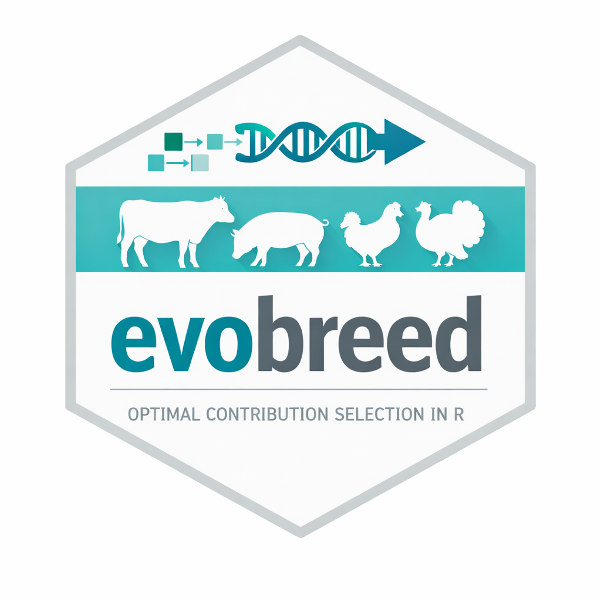

# evobreed



**Optimal Contribution Selection (OCS) for livestock breeding in R.**

evobreed provides tools for genetic gain–diversity trade-off optimization using the OCS framework. Given a candidate population with estimated breeding values (EBVs) and a pedigree-derived relationship matrix, it solves for the contribution weights (and optionally integer mating allocations) that maximize genetic gain subject to a mean kinship constraint — or traces the full Pareto frontier between the two objectives.

---

## Background

Optimal Contribution Selection (Meuwissen 1997) is the theoretically optimal strategy for long-term livestock genetic improvement. Rather than truncation-selecting the top animals, OCS assigns each candidate a *contribution* — the proportion of the next generation's genes that animal provides. By jointly optimizing:

- **Genetic gain**: weighted mean EBV across selected animals
- **Genetic diversity**: mean kinship of the next generation (c′Ac, where A is the additive relationship matrix)

OCS sits on the efficient Pareto frontier between these two objectives, allowing breeders to choose their preferred gain/diversity balance rather than accepting the fixed diversity loss of truncation selection.

---

## Features

- **Pedigree simulation** — `build_ped()` generates multi-generation pedigrees with configurable population sizes, litter sizes, and sex ratios
- **Additive relationship matrix** — `build_a_matrix()` computes A from a pedigree using `pedigreemm` when available, with an automatic fallback to the Henderson (1976) tabular method
- **Continuous OCS** — real-valued contribution optimization via a genetic algorithm; sex-ratio constraint enforced by reparameterization (no penalty terms)
- **Discrete/constrained OCS** — integer mating allocation per male (capped at a configurable maximum), binary female selection; largest-remainder method ensures the mating total is always exact
- **Pareto frontier sweep** — sensitivity analysis across target angles from 0° (maximum diversity) to 90° (maximum gain) to characterize the full trade-off curve

---

## Installation

Install evobreed from GitHub with `pak`:

```r
install.packages("pak")
pak::pak("austin-putz/evobreed")
```

To install a fixed version from GitHub, pin the install to a release tag,
branch, or commit SHA:

```r
# Latest GitHub release
pak::pak("austin-putz/evobreed@*release")

# A specific release tag
pak::pak("austin-putz/evobreed@v0.1.0")

# A specific branch
pak::pak("austin-putz/evobreed@main")

# A specific commit
pak::pak("austin-putz/evobreed@abc1234")
```

For reproducible analyses, prefer a release tag or full commit SHA over the
default branch, since the default branch changes as development continues.

Then load the package:

```r
library(evobreed)
```

**Dependencies:**

`pak` installs package dependencies automatically. The example scripts also use `GA`, `Matrix`, `dplyr`, and `ggplot2`; `pedigreemm` is recommended for faster A-matrix computation.

```r
install.packages("pedigreemm")
```

---

## Quick Start

### 1. Build a pedigree and relationship matrix

```r
library(evobreed)

ped <- build_ped(
  n_male_founders   = 5,
  n_female_founders = 5,
  n_gen             = 3,
  n_males_per_gen   = 10,
  n_females_per_gen = 10,
  litter_size       = 2,
  seed              = 42
)

A <- build_a_matrix(ped)
```

### 2. Run continuous OCS (real-valued contributions)

```r
source("scripts/breeding_optimization_example.R")
```

This script:
1. Simulates a 3-generation pedigree (65 animals total)
2. Assigns random EBVs to last-generation candidates
3. Runs a genetic algorithm to find optimal contributions at a 45° Pareto angle
4. Sweeps angles 0°–90° to trace the full gain/diversity frontier

### 3. Run constrained OCS (integer matings + binary female selection)

```r
source("scripts/breeding_optimization_constrained.R")
```

This script enforces practical mating constraints:
- Exactly 5 females selected, each mated once
- Males receive 0–3 matings (integer-valued)
- Total matings always equals the number of selected females

---

## OCS Problem Formulation

### Objectives

| Objective | Formula | Direction |
|-----------|---------|-----------|
| Genetic gain | Σ cᵢ · EBVᵢ | Maximize |
| Mean kinship | **c**′ **A** **c** | Minimize |

### Pareto angle

The `target_angle` parameter (degrees, 0–90) controls where on the Pareto frontier the optimizer aims:

| Angle | Gain weight | Diversity weight | Behavior |
|-------|-------------|-----------------|---------|
| 0° | 0.00 | 1.00 | Equal contributions across all animals |
| 45° | 0.71 | 0.71 | Balanced gain and diversity |
| 90° | 1.00 | 0.00 | All weight on top animals (truncation selection) |

Weights are computed as sin(θ) and cos(θ) so they always sum to 1 on the unit circle.

### Sex ratio constraint

Male contributions are normalized to sum to `sex_ratio` (default 0.5); female contributions to `1 - sex_ratio`. This reparameterization makes the constraint automatically satisfied — no penalty term required.

---

## Pedigree Utilities

### `build_ped()`

Simulates a multi-generation pedigree. Founders (generation 0) have no parents. Subsequent generations use random mating: dams sampled without replacement; sires sampled with replacement.

| Parameter | Default | Description |
|-----------|---------|-------------|
| `n_male_founders` | 5 | Males in generation 0 |
| `n_female_founders` | 5 | Females in generation 0 |
| `n_gen` | 3 | Number of offspring generations |
| `n_males_per_gen` | 10 | Target males per generation |
| `n_females_per_gen` | 10 | Target females per generation |
| `litter_size` | 2 | Offspring per dam per generation |
| `seed` | NULL | RNG seed for reproducibility |

Returns a `data.frame` with columns `id`, `sire`, `dam`, `sex`, `gen`, ordered parents-before-offspring.

### `build_a_matrix()`

Computes the additive relationship matrix (A) where A[i,j] = 2 × kinship(i,j) and the diagonal equals 1 + Fᵢ (inbreeding coefficient). Uses `pedigreemm::getA()` when installed; otherwise falls back to the Henderson (1976) tabular method (suitable for n < ~5,000 animals).

---

## References

- Meuwissen, T.H.E. (1997). Maximizing the response of selection with a predefined rate of inbreeding. *Journal of Animal Science*, 75(4), 934–940.
- Henderson, C.R. (1976). A simple method for computing the inverse of a numerator relationship matrix used in prediction of breeding values. *Biometrics*, 32(1), 69–83.
- Woolliams, J.A., Berg, P., Dagnachew, B.S., & Meuwissen, T.H.E. (2015). Genetic contributions and their optimization. *Journal of Animal Breeding and Genetics*, 132(2), 89–99.

---

## License

GPL-3
